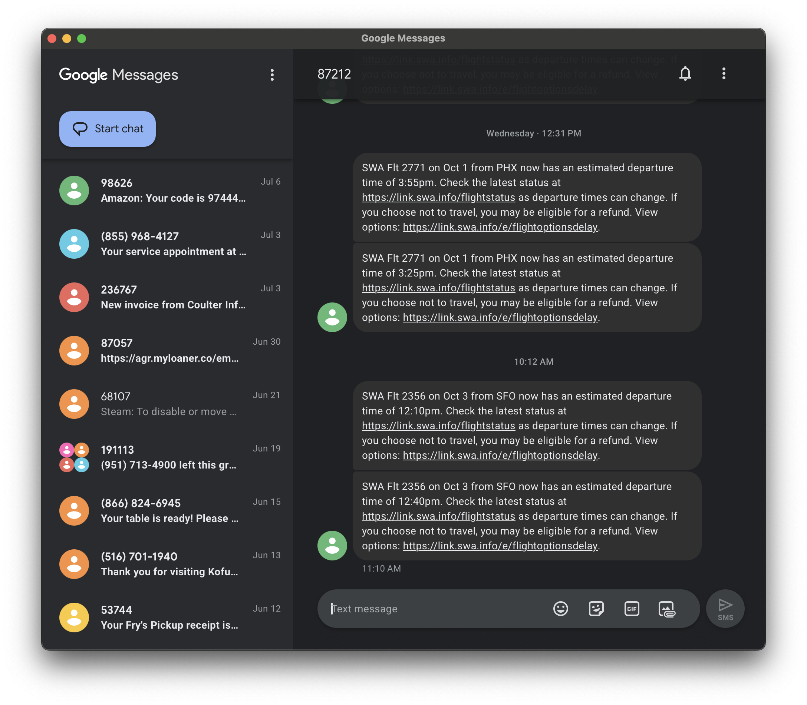

# Google Messages Desktop

A simple, lightweight, unofficial desktop wrapper for Google Messages, built with [Tauri](https://tauri.app/).



## Features

* **Lightweight**: Uses your operating system's native WebView, resulting in a tiny app size and low memory usage.
* **Cross-Platform**: Can be built for macOS, Windows, and Linux from a single codebase.
* **Simple**: No extra frills. Just the Google Messages web client in its own dedicated window.

## Installation

You can download the latest version for your operating system from the [Releases](https://github.com/vivin/google-messages-desktop/releases) page.

* **macOS**: Download the `.dmg` file. Open it and drag the app to your Applications folder.
* **Windows**: Download the `.msi` file and run the installer.
* **Linux**: For Debian, Ubuntu, or derived distros use the `.deb` file. Otherwise use the `.AppImage` file (which will work on any Linux distro).

## Building from Source

If you'd like to build the application yourself, you'll need to set up the Tauri development environment.

### Prerequisites

* [Rust and Cargo](https://www.rust-lang.org/tools/install)
* [Node.js and npm](https://nodejs.org/en/)
* [Tauri CLI Prerequisites](https://tauri.app/v1/guides/getting-started/prerequisites) for your specific OS.

### Steps

1.  **Clone the repository:**
    ```bash
    git clone [https://github.com/vivin/google-messages-desktop.git](https://github.com/vivin/google-messages-desktop.git)
    cd google-messages-desktop
    ```

2.  **Install NPM dependencies:**
    ```bash
    npm install
    ```

3.  **Run in development mode:**
    ```bash
    npm run tauri dev
    ```

4.  **Build the application:**
    ```bash
    npm run tauri build
    ```
    The final executables will be located in `src-tauri/target/release/bundle/`.

## Disclaimer

This project is not affiliated with, endorsed by, or sponsored by Google in any way. It is an unofficial, third-party application that provides a wrapper around the official Google Messages web client. All trademarks and logos are the property of their respective owners.

## License

This project is licensed under the MIT License.
